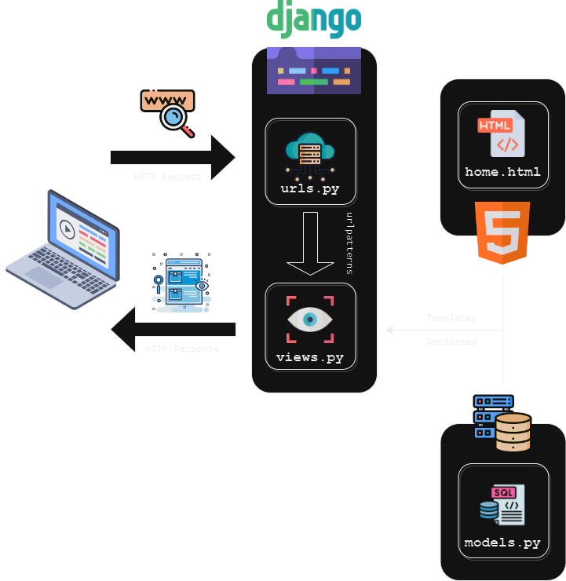

[Application Link](https://trading-inventory.adaptable.app)
<h1 style='color:red'> Tugas 1 </h1>
# Cara Implementasi
## Perbedaan antara POST dan GET pada Django?
## Perbedaan utama antara XML, JSON, dan HTML dalam konteks pengiriman data?
## Mengapa JSON sering digunakan dalam pertukaran data antara aplikasi web modern?
# Screenshot Postman

-----

<h1 style='color:red'> Tugas 2 </h1>
# Cara Implementasi
## Setup Library yang dibutuhkan
Membuat file `requirements.txt` yang berisi
```
django
gunicorn
whitenoise
psycopg2-binary
requests
urllib3
```
Installasi dapat dilakukan pada terminal dengan:
1. Tanpa Virtual Environment
```sh
pip install -r requirements.txt
```
2. Menggunakan Virtual Environment
```sh
python -m venv venv # Buat virtual env
./venv/Scripts/activate # pada windows atau
source venv/Scripts/activate # pada mac
pip install -r requirements.txt
```

## 1. Membuat sebuah proyek Django baru

Menggunakan `django-admin createproject NAME` kita akan membuat direktori baru dengan nama `NAME`. Direktori akan berisi `manage.py` dan folder `NAMA` yang berisi terkait setting dan routing dari proyek. `manage.py` adalah script python yang akan kita gunakan untuk memantain dan mengatur proyek kita. `python manage.py runserver` adalah command untuk menjalankan proyek kita (**Pastikan untuk menjalankan ini sebelum menuju `http://localhost:8000/hello` yang merupakan url web django kita**).

## 2. Membuat aplikasi dengan nama main

`python manage.py createapp APPNAME` digunakan untuk membuat applikasi pada proyek kita dengan nama `APPNAME`. Applikasi dalam bentuk folder baru dengan nama `APPNAME`. Setelah membuat applikasi, kita perlu mendaftarkannya pada `settings.py` yang terletak di folder proyek. Tambahkan `APPNAME` pada `INSTALLED_APPS` sehingaa berbentuk seperti
```python
INSTALLED_APPS = [
    'django.contrib.admin',
    'django.contrib.auth',
    'django.contrib.contenttypes',
    'django.contrib.sessions',
    'django.contrib.messages',
    'django.contrib.staticfiles',
    'APPNAME'
]
```
## 3. Melakukan routing proyek agar dapat menjalankan aplikasi
Konfigurasi link `APPNAME` pada proyek dengan cara menambahkan `path('aplikasi/', include('main.urls'))` pada `urls.py` yang terletak di direktori proyek. Sehingga kurang lebih seperti
```python
from django.contrib import admin
from django.urls import path, include

urlpatterns = [
    path('admin/', admin.site.urls),
    path('iniapp', include('main.urls'))
]

```
Buatlah `urls.py` pada folder `APPNAME` dengan kode:
```python
from django.urls import path
from . import views

urlpatterns = [
	path('hello/', views.hello),
]
```
Dengan begini ketika kita menuju `http://localhost:8000/iniapp/hello` pada browser, kita akan dihadapkan dengan apa yang direturn fungsi `hello` pada `views.py`
Jika kita ingin applikasi langsung berada pada main path seperti `http://localhost:8000/hello`, kita bisa set `urlpatterns` pada `urls.py` proyek dengan `path('', include('main.urls'))`

## 4. Membuat fungsi render pada views.py
Untuk mengatur apa yang ingin user lihat ketika menuju `http://localhost:8000/hello`, kita dapat mengembalikan html templates.
Buat direktori `templates` pada `APPNAME` dan masukan html yang akan dirender dengan nama `hello.html`. Contoh `hello.html` yang akan menampilkan nama dan kelas.
```html
<head>
<title>Trading Inventory</title>
</head>
<body>
<h1>Nama : Eryawan Presma Yulianrifat</h1>
<h1>Kelas : PBP D</h1>
</body>
```
pada `views.py` kita dapat mengembalikan `hello.html` dengan cara
```python
from django.shortcuts import render
from django.http import HttpResponse

def main(request):
    return render(request, 'hello.html')
```
Perubahan dapat dilihat langsung pada `http://localhost:8000/hello`.

## 5. Membuat model sebagai Database
Model adalah penghubung python dengan database kita. Model pada `APPNAME` berada pada `models.py`. Jika kita ingin membuat database yang berisi nama, amount, dan description masing-masing dengan tipe data character, integer, dan text kita dapat melakukannya dengan memodif `models.py` seperti
```python
from django.db import models

class Item(models.Model):
    name = models.CharField(max_length=4)
    amount = models.IntegerField()
    description = models.TextField()
```
    Mengkoneksikan database dengan view akan dibahas dikemudian hari setelah tutorial PBP selanjutnya xixi.
 
## Melakukan deployment ke Adaptable
Pastikan repository proyek sudah berada pada github dan bersifat public. Selanjutnya, pada adaptable, pilih opsi `deploy a new app`. Pilih repository sesuai proyek yang akan dideploy. Kemudian `Python App Template`. Selanjutnya adalah opsi database, sementara bisa menggunakan `PostgreSQL`. Sesuaikan versi python dengan versi lokal, `python --version` pada terminal lokal untuk melihat versi. Dan masukan `python manage.py migrate && gunicorn NAMA_PROYEK.wsgi` pada `Start Command`. Tentukan nama applikasi dan checklist `HTTP Listener on PORT`.

# Bagan Applikasi Berbasis Django


1. Client memerintahkan browser untuk mengunjungi situs berbasis django (ex: instagram.com)
2. Browser akan mengirimkan permintaan (HTTP Request) webpage/halaman web kepada server instagram.com
3. Request akan sampai pada routing yang dihandle pada `urls.py` yang akan mencari pattern url yang dituju oleh client
4. Setelah pattern ditemukan, django akan memanggil fungsi pada `views.py` terkait yang terikat terhadap url tersebut.
5. `views.py` dapat melakukan logika dan operasi database yang terdefinisi arsitekturnya pada `models.py`
6. Setelah operasi selesai, `views.py` akan mengirimkan webpage/halaman web yang diminta client dalam bentuk html yang terdapat pada direktori `templates/`.
7. Browser client merender `html` yang merupakan response (HTTP Response) dari server django.

# Mengapa Virtual Environment
Virtual Environment berguna untuk memanage package python secara terisolasi dari package python sistem kita. Dengan kata lain, kita semacam memiliki python yang berbeda-beda untuk tiap proyek kita. `./venv/Scripts/activate` berguna untuk memberikan instruksi pada shell bahwa kita akan menggunakan virtual environment python. `deactivate` memerintahkan shell untuk kembali ke python sistem. `pip install -r requirements.txt` berguna untuk menginstall package yang ada pada `requirements.txt` (library yang digunakan proyek kita). Isolasi virtual env berguna untuk membuat orang lain yang ingin menggunakan proyek kita mengetahui apa yang mereka perlukan. Sehingga mereka menginstall library secukupnya saja, tidak semuanya pada sistem python kita. Bayangkan jika hendak menjalankan proyek django tapi kita diminta untuk menginstall tensorflow.

Membuat proyek django tanpa virtual env dapat dilakukan asalkan python sistem kita kita memiliki semua depedensi yang akan digunakan.

# Apa itu MVC, MVT, MVVM
1. **MVC** (Model View Controller) adalah pattern desain framework yang memisahkan applikasi menjadi 3 komponen, yaitu model, view, dan controller. MVC adalah komponen yang sering digunakan industri untuk membuat applikasi yang scalable dan extensible.


2. **MVT** (Model View Template) adalah pattern desain yang mirip dengan MVC. Perbedaannya adalah controller diimplementasikan oleh framework sendiri sehingga kita hanya perlu membuat template. Memungkinkan untuk pengembangan yang lebih scalable, cepat, namun terdapat ketergantungan terhadap framework yang digunakan.


3. **MVVM** (Model View ViewModel) adalah pattern desain yang fokus pada membedakan user interface (UI) dengan logic dari applikasi kita. Controller pada MVVM berada pada ViewModel. Memungkinkan untuk pemisahan kerja yang lebih baik antara UI dan logic sesuai dengan kelebihan pengembang. ViewModel dapat terlihat sangat kompleks dan susah didebug jika sudah terdapat banyak logic dan binding. 
