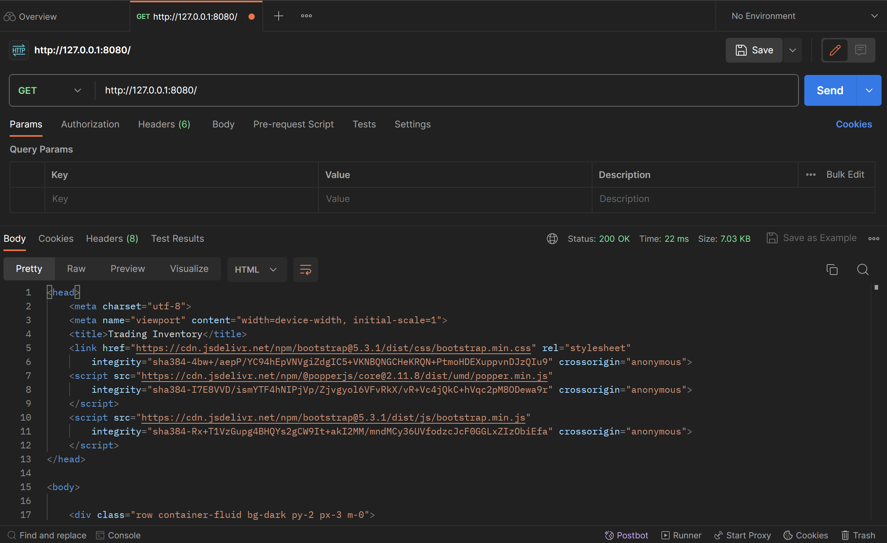
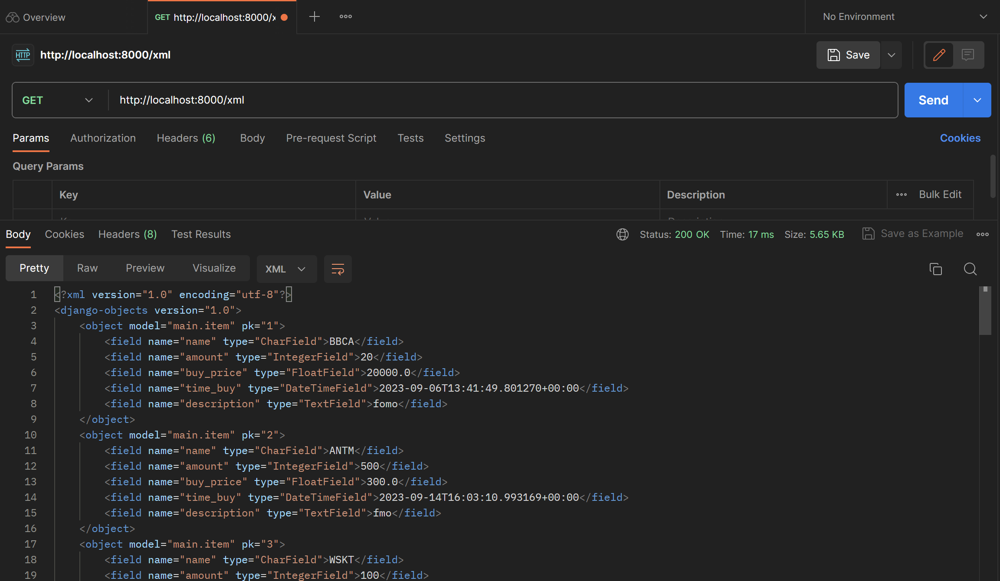
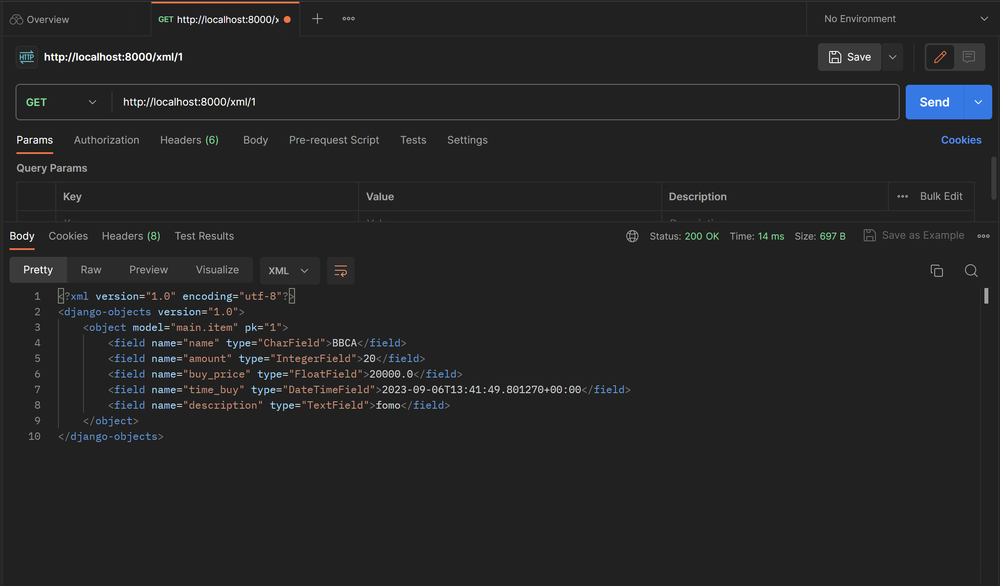
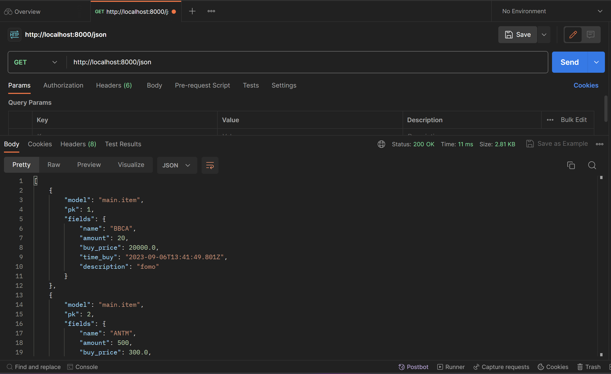
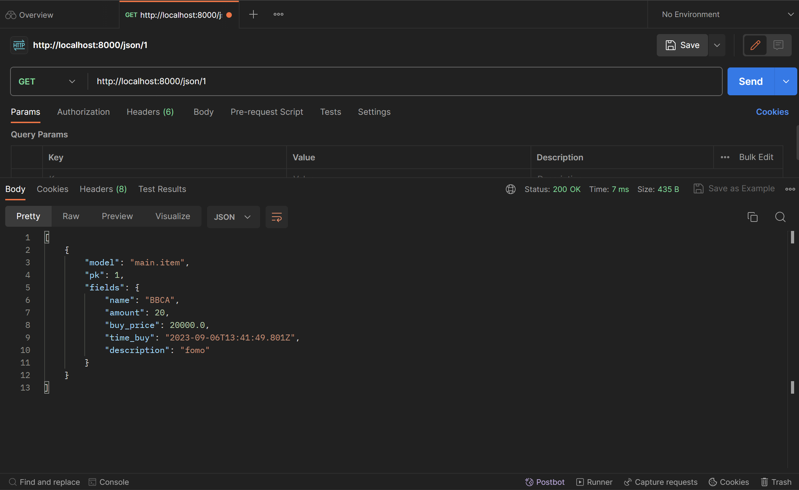

[Application Link](https://trading-inventory.adaptable.app)

<h1 style='color:red'> Tugas 5 </h1>

# Cara Implementasi

## 1. Kustomisasi page main
Pada page main, saya mengubah tampilannya menggunakan card. Pada luaran, saya div `class="row"` yang di dalamnya terdapat div `class="col"` untuk setiap data. Fungsi dari 2 class ini digunakan untuk membuat grid view yang responsif pada bootstrap. Di dalam div tersebut, saya menggunakan `class="card"` untuk membuat sebuah card. Untuk kustomisasi card lebih lanjut, saya menggunakan `class="card-header"` untuk membuat header pada card, `class="card-body"` untuk membuat body card, dan `class="card-footer"` untuk membuat footer pada card. Saya juga menambahkan background dengan mengguanakn `class="bg-dark"` dan `class="bg-success"` untuk membuat background berwarna gelap dan hijau.  
**Sumber:** [Dokumentasi Bootstrap Card](https://getbootstrap.com/docs/5.3/components/card/#about)

## 2. Kustomisasi pada form
Pada form, saya memecah komponen form dari django yang kemudian saya kustomisasi sendiri menggunakan bootstrap. Komponen form saya dapatkan dengan mengakses `form.hidden_fields` dan `form.visible_fields`. Saya memberikan `class="py-1 form-control"` pada setiap komponen input untuk membuatnya lebih menarik sesuai dengan template bootstrap.
```python

    {{ hidden_field }}



    <div class="form-group px-3">
        {{ field.errors }}
        <label style="font-weight: 500;">{{field.label}}</label>
        <div class="py-1"></div>
        
        <div class="py-2"></div>
    </div>

```

Sumber: [Dokumentasi Form Django](https://docs.djangoproject.com/en/4.2/topics/forms/)

# Pertanyaan

## Jelaskan manfaat dari setiap element selector dan kapan waktu yang tepat untuk menggunakannya.

Terdapat beberapa selector yang dapat digunakan pada CSS. Selector digunakan untuk memberikan styling yang telah diset kepada sebuah tag html.

1. **Element Selector**, Digunakan untuk memilih elemen HTML berdasarkan nama elemennya.

```css
p {
  color: blue;
}
```
2. **Id selector**, Digunakan untuk memilih elemen dengan atribut "id" tertentu.

```css
#header {
  background-color: blue;
}
```

3. **Class Selector**, Digunakan untuk memilih elemen dengan atribut "class" tertentu.
```css
.btn-primary {
  background-color: blue;
}
```

## Jelaskan HTML5 Tag yang kamu ketahui.

HTML5 adalah versi terbaru dari HTML. Beberapa tag HTML5 yang dapat digunakan adalah:

1. `<canvas>` digunakan untuk membuat gambar, grafik, dan animasi dengan bantuan JavaScript.
2. `<video>` digunakan untuk memperlihatkan video pada halaman web.
3. `<nav>` digunakan untuk membuat bagian navigasi situs web
4. `<audio>` digunakan untuk memperlihatkan file audio pada halaman web.
5. `` digunakan untuk memperlihatkan gambar dalam halaman web.
6. `<a>` digunakan untuk membuat hyperlink ke halaman web lain, file, dan sebagainya.

## Jelaskan perbedaan antara margin dan padding.

Margin dan padding adalah properti CSS yang digunakan untuk mengatur tata letak antar elemen HTML. **Margin** mengatur jarak antara elemen tersebut dan elemen-elemen lain di sekitarnya sedangkan **Padding** mengatur jarak diantara elemen di dalam tag tersebut. Contoh terbaik dalam membedakan keduanya adalah pada saat membuat button dengan text di dalamnya.


## Jelaskan perbedaan antara framework CSS Tailwind dan Bootstrap. Kapan sebaiknya kita menggunakan Bootstrap daripada Tailwind, dan sebaliknya?

Bootstrap menyediakan komponen-komponen yang sudah jadi sehingga tinggal kita pakai sedangkan tailwind menyediakan template-template lebih dasar yang harus kita gabungkan terlebih dulu untuk memakainya. Sehingga perbedaannya adalah **tailwind** unggul pada kustomisasi namun lemah pada **kecepatan implementasi** sedangkan **bootstrap** unggul pada **kecepatan implementasi** namun lengah pada **kustomisasi**.

Waktu terbaik menggunakan **tailwind** adalah disaat kita diminta membuat website dengan desain kompleks dengan jangka waktu yang **lama**. Sedangkan bootstrap adalah ketika kita diminta membuat website **simpel** dengan jangka waktu yang **pendek**.

<h1 style='color:red'> Tugas 4 </h1>

# Cara Implementasi

## 1. Membuat Page Register

Membuat template `html` dengan nama `register.html` yang dilengkapi dengan pesan yang dapat kita kirimkan ke user jika registrasi berhasil. Pengiriman pesan ini dapat menggunakan interface django `django.contrib.messages`. Kita dapat customisasi tampilan form dengan memanfaatkan `widget_tweaks` dan mengambil komponen-komponen template form dan memasukan komponen bootstrap kedalamnya. `register.html` kurang lebih akan seperti i  ni. 
```html



    <div class="container rounded p-3 m-5 bg-dark text-white", style="width: auto, display: block;">
        <h1 class="m-3">Sign Up</h1>
        <form method="post">
            
            
                {{ hidden_field }}
            
    
            
                <div class="form-group px-3">
                    {{ field.errors }}
                    <label style="font-weight: 500;">{{field.label}}</label>
                    <div class="py-1"></div>
                    
                    <div class="py-2"></div>
                </div>
            
            <input class="btn btn-primary rounded mx-3 my-3" style="font-weight: 700;" type="submit" name="submit" value="Daftar">
            <a href= class="btn btn-primary rounded label mx-5" style="font-weight: 700;"    >Sign In</a>
        </form>
        
            <ul>
                
                    <li>{{message}}</li>
                
            </ul>
        
    </div>

```
`form` adalah form django yang akan kita passing dan `messages` adalah template bawaan django yang akan kita gunakan pada `views.py`
```python
from django.contrib.auth.forms import UserCreationForm
import django.contrib.messages as messages

def signup(request):
    form = UserCreationForm()
    if request.method == 'POST':
        form = UserCreationForm(request.POST)
        if form.is_valid():
            form.save()
            messages.success(request, 'Your account has been created!!!')
            return redirect('main:login')
    context = {
        'form': form
    }
    return render(request, 'register.html', context)
```
`views.py` kurang lebih menggunakan template bawaan `UserCreationForm` untuk membuat form pembuatan user, dan `messages` untuk mengirim pesan ke user. `messages` tidak perlu dipasing pada context. Forms kemudian disimpan pada database yang kemudian kita dapat gunakan untuk login.

## 2. Membuat Page Login

Tidak ada template login form pada django sehingga kita perlu implement komponennya tersendiri. Untuk setiap komponen input, atribut `name` diperlukan agar nilainya dapat ditangkap pada django. Berikut contoh `login.html` saya implementasikan.
```html


<style>
.label {
    font-weight: 700;
}
</style>


<div class="container rounded p-3 m-5 bg-dark text-white", style="width: auto, display: block;">
    <div class="p-3">
        <h1>Login</h1>
        <form method="post" action="">
            
            <label class="text-white label">Username</label>
            <div class="py-1">
            <td>
                <input type="text" name="username" placeholder="Username" class="form-control">
            </td>
            <div class="py-3">

            <label class="text-white label">Password</label>
            <div class="py-1">
            <td>
                <input type="password" name="password" placeholder="Password" class="form-control">
            </td>
            <div class="py-3">
            <input type="submit" class="btn btn-primary rounded label">
        </form>
        <a href= class="btn btn-primary rounded label mx-5">Sign Up</a>
        
        <div class="py-3">
        <ul>
            
            <li>{{message}}</li>
            
        </ul>
        
    </div>
</div>

```
Pada `views.py`, kita perlu mengambil parameter username dan password sesuai dengan attribut `name` yang kemudian dapat menggunakan interface django `authenticate` untuk memverifikasi `user` yang sudah kita save sebelumnya. `login` adalah method bawaan django juga untuk memberi tahu user yang sedang login. Selanjutnya kita dapat mengakses user pada request dengan cara `request.user`.
```python
from django.contrib.auth import authenticate, login
def login_page(request):
    if request.method == 'POST':
        username = request.POST.get('username')
        password = request.POST.get('password')
        user = authenticate(request, username=username, password=password)
        if user is not None:
            login(request, user)
            return redirect('main:main')
        messages.warning(request, 'Incorrect Username or Password')
    context = {}
    return render(request, 'login.html', context)
```
Lalu bagaimana cara kita membatasi sebuah page agar user yang login bisa mengaksesnya? kita dapat memanfaatkan decorator `login_required`, lagi-lagi django membuat hidup kita gampang!. Implementasinya kurang lebih sebagai berikut untuk membatasi page `main`.
```python
from django.contrib.auth.decorators import login_required
@login_required(login_url='/login')
def main(request: HttpRequest):
    ...
```

## 3. Menghubungkan User dengan Models

Menghubungkan user dengan model pada django cukup simpel, kita dapat menggunakan interface `User` pada `django.contrib.auth.models` dan menambahkannya sebagai `ForeignKey`.
```python
from django.contrib.auth.models import User
class Item(models.Model):
    user = models.ForeignKey(User, models.CASCADE)
    name = models.CharField(max_length=4, name='name')
    amount = models.IntegerField(name='amount')
    buy_price = models.FloatField(name='buy_price')
    time_buy = models.DateTimeField(name='time_buy', auto_now_add=True)
    description = models.TextField(max_length=30, name='description')
```
Sehingga saat pembuatan object item, kita juga perlu mengassign user terkait. Sehingga pada fungsi `create` terkait pembuatan `Item` kurang lebih implementasinya akan seperti berikut.
```python
def create(request: HttpRequest):
    print(request.POST)
    form = ItemForm(request.POST or None)

    if request.method == 'POST':
        newdata = form.save(commit=False)
        newdata.user = request.user
        newdata.save()
        return HttpResponseRedirect(reverse('main:main'))
    return render(request, 'add.html', dict(form=form))
```
Kita menambahkan user terlebih dahulu sebelum menyimpan data.

## 4. Membuat Cookie Informasi Last Login

Cookie adalah penyimpanan pada client yang bersifat sementara dan kecil. Implementasi cookie pada django terbilang simpel. 
```python
def logout_page(request: HttpRequest):
    logout(request)
    response = redirect('main:login')
    response.set_cookie('last_login', datetime.datetime.now().strftime('%Y-%m-%d %H:%M:%S'))
    return response
```
Kita menyisipkan cookie pada response untuk memberi tau browser client variabel yang akan disimpan. Sedangkan untuk mengambil nilai cookie kita dapat melakukan `last_login = request.COOKIES['last_login']`.

## 5. Bonus: button add dan button minus

Pertama-tama, widget button perlu kita tambahkan pada html.
```python
...
<td class="text-center"><a href="minus_amount/{{forloop.counter}}"></a></td>
<td class="text-center"><a href="add_amount/{{forloop.counter}}"></a></td>
...
```
Button tersebut akan mengarah ke url `minus_amount/ID` atau `add_amount/ID` dimana `ID` adalah id item yang akan diubah. Implementasi `add_amount/ID` kurang lebih sebagai berikut.
```python
@login_required(login_url='/login')
def add_amount(request: HttpRequest, id: int):
    user_data = Item.objects.filter(user=request.user).filter(pk=id).first()
    user_data.amount += 1
    user_data.save(update_fields=['amount'])
    response = redirect('main:main')
    return response
```
Dimana kita mengubah nilai dan mengupdate database yang kemudian kembali ke page main. Untuk memberikan notifikasi update, kita dapat memanfaatkan cookie mengset opsi terakhir yang dipilih oleh user. Cookie dapat dilihat diimplementasikan dengan mengubah `response` di atas menjadi.
```python
def add_amount(request: HttpRequest, id: int):
    ...
    response = redirect('main:main')
    response.set_cookie('ref', f'Adding 1 Amount of {user_data.name} succeed!!!')
    return response
```
Sehingga pada `main` kita dapat mendapatkan cookie dan memasukannya ke context untuk disesuaikan htmlnya.
```python
@login_required(login_url='/login')
def main(request: HttpRequest):
    ...
    try:
        ref = request.COOKIES['ref']
    except KeyError:
        ref = False
    context = {
        ref = ref,
        ...
    }
    return render(request, 'main.html', context)
```
```html
...

    <h3 style="color: green;">{{ref}}</h3>

```

# Pertanyaan

##  Apa itu Django UserCreationForm, dan jelaskan apa kelebihan dan kekurangannya?

Django `UserCreationForm` adalah sebuah `form` yang mirip dengan `ModelForm`. Penggunaannya kurang lebih sama. Kelebihannya adalah kemudahan dan kecepatannya dalam membuat `form` user. Kita tidak perlu membuat models seputar user, kita dapat langsung menyimpannya dalam database. Kelemahannya mungkin ada pada customisasi. Namun, pada dasarnya kita dapat membreak down komponen komponen sehingga sebenarnya customisasi dapat dilakukan. Menurut saya, `form` pada django adalah sebuah shortcut. Kemampuan untuk customisasi membuatnya tidak mempunyai kekurangan.

## Apa perbedaan antara autentikasi dan otorisasi dalam konteks Django, dan mengapa keduanya penting?

Autentikasi adalah proses memverifikasi client sedangkan otorisasi adakah akses yang dapat dilakukan oleh client. Sehingga autentikasi dilakukan sebelum otorisasi. Keduanya penting karena tentu harus ada admin yang mengatur database kita. Selama ini, kita, sebagai developer mengatur penghapusan dan pemantauan database menggunakan command line yang mana tidak efektif. Admin bisa saja seorang HRD, atau spesialis lainnya yang bukan merupakan seorang programmer. Kita perlu menyediakan interface khusus yang memudahkan mereka.

## Apa itu cookies dalam konteks aplikasi web, dan bagaimana Django menggunakan cookies untuk mengelola data sesi pengguna?

Cookie adalah penyimpanan pada client yang bersifat sementara. Server melalui response meminta browser untuk menyimpan data mirip dengan struktur data dictionary/hash map. Browser kemudian meyimpan cookie yang kemudian akan selalu menyisipkan cookie pada request browser selanjutnya kepada website tersebut. Sehingga pada browser, cookie memiliki variabel name dan value (data yang disimpan), domain website, path pada domain tersebut, tanggal expired, size cookie, dan sebagainya (priority, SameSite, dll). Cookie dapat dilihat oleh client mentah-mentah sehingga kurang cocok untuk digunakan sebagai penyimpanan sesuatu yang rahasia.

## Apakah penggunaan cookies aman secara default dalam pengembangan web, atau apakah ada risiko potensial yang harus diwaspadai?

Karena cookie disimpan pada client, keamanan bergantung sepenuhnya pada aktivitas client. Cookie secara transparan dapat dilihat oleh client melalui browser sehingga informasi sensitif tidak cocok untuk ditampilkan. Dikarenakan transparasinya, cookie dapat dicopy dan ditiru dengan mudah. Terdapat attack yang bernama cookie stealing yang dapat menipu server dengan mudah. 

---

<h1 style='color:red'> Tugas 3 </h1>

# Cara Implementasi

## 1. Membuat Form (`forms.py`)

`APP/forms.py` akan mengimplementasikan library `django.forms` yang akan mempermudah pembuatan form kita. Seluruh html sudah dihandle oleh library form tersebut. Contoh isi `APP/forms.py` adalah.
```python
from main.models import Item
class ItemForm(ModelForm):
    class Meta:
        model = Item
        fields = ['name', 'amount', 'buy_price', 'description']
```
dimana `name`, `amount`, `buy_price`, dan `description` adalah field yang ada pada model `Item` yang sudah didefinisikan.

## 2. Merender form yang dibuat

Untuk merender form yang sudah kita buat, kita dapat menggunakan kemudahan library django. Pada `html` yang akan kita buat, kita dapat menulis.
```html
<form method="POST">
    
    <table>
        {{ form.as_table }}
        <tr>
            <td></td>
            <td>
                <input type="submit" value="Add Product"/>
            </td>
        </tr>
    </table>
</form>
```
`csrf_token` token wajib didefinisikan setiap definisi form, hal ini terkait dengan keamanan. `form.as_table` akan merender form secara keseluruhan kecuali button submit yang perlu kita tulis sendiri. Jika ingin memodifikasi form agar lebih estetik, kita dapat menggunakan attribut dari `form` seperti `form.visible_fiels`, `form.hidden_fields` dan sebagainya yang tertera pada [dokumentasinya](https://docs.djangoproject.com/en/4.2/topics/forms/).

## 3. Menambahkan view untuk serializer json dan xml

Serializer digunakan untuk mengirim data dalam bentuk `json` dan `xml`. Data ini dapat digunakan sebagai interface program lain (API). Dalam django, serializer diimplementasikan pada `views.py` dengan mereturn `HTTPResponse` dengan `application_type` `application/json` atau `application/xml`. Berikut contoh kodenya.
```python
from django.core import serializers
from main.models import Item
def show_xml(request):
    data = Item.objects.all()
    return HttpResponse(serializers.serialize('xml', data), content_type='application/xml')
```
```python
def show_json(request):
    data = Item.objects.all()
    return HttpResponse(serializers.serialize('json', data), content_type='application/json')
```

## 4. Membuat getter dengan dynamic routing

Dynamic routing digunakan untuk menyesuaikan data dengan input dari user melalui url. Contoh, jika kita ingin mendapatkan `Item` **pertama** pada database kita dapat menuju url `www.outapp/1`. Implementasinya pada django dengan mengubah `urls.py` dan `views.py`. Pada `urls.py`
```python
from django.urls import path

urlpatterns = [
    ...
    path('xml/<int:id>', views.show_xmlbyid, name='xmlbyid'),
    path('json/<int:id>', views.show_jsonbyid, name='jsonbyid'),
]
```
Sedangkan pada `views.py`
```python
def show_xmlbyid(request, id: int):
    data = Item.objects.filter(pk=id)
    print(data)
    return HttpResponse(serializers.serialize('xml', data), content_type='application/xml')

def show_jsonbyid(request, id: int):
    data = Item.objects.filter(pk=id)
    return HttpResponse(serializers.serialize('json', data), content_type='application/json')
```

# Pertanyaan

## Perbedaan antara POST dan GET pada Django?

**POST** adalah method protokol `HTTP` yang berfokus pada pengiriman data. Pengiriman data pada `POST` dikirim melalui body request membuatnya tidak mudah terlihat. `POST` biasanya digunakan saat melakukan update data kepada server seperti *sign up*, upload file, dan sebagainya

**Get** adalah method protokol `HTTP` yang fokus pada simplisitas. Data yang dikirim akan disimpan pada `url` yang dituju. Contohnya pada saat mencari video pada youtube, url yang kita tuju akan berpola `youtube.com/results?search_query=[KEYWORD PENCARIAN]`. Dikarenakan pengiriman data yang terjadi pada url, method `GET` tidak cocok untuk mengirim data rahasia seperti data saat *sign up*. Bayangkan jika kalian `sign up` pada sebuah website dengan url `insta.com/signup/username=eryaw&passowrd=joget`, akan menjadi aneh bukan?. `GET` method cocok untuk mendapatkan data seperti file html website yang perlu kita render (yang biasa kita lakukan), query database `insta/user/eryawwww` untuk mendapatkan user `eryawww` dan sebagainya.

## Perbedaan utama antara XML, JSON, dan HTML dalam konteks pengiriman data?

**HTML** digunakan untuk mengirin sebuah halaman dengan segala peletakan desain, kontennya, script, dan sebagainya. `HTML` lebih cocok jika client adalah manusia yang menggunakan browser. Jika client merupakan sebuah applikasi untuk mengambil data otomatis (API), `HTML` akan lebih susah dipahami karena diperlukan parsing terlebih dahulu yang memakan waktu dan tidak efisien.
```html
<!DOCTYPE html>
<html lang="en">
<head>
    <meta charset="UTF-8">
    <meta name="viewport" content="width=device-width, initial-scale=1.0">
    <title>Document</title>
</head>
<body>
    <div class="row container-fluid bg-dark py-2 px-3 m-0">
        <a class="col text-white h-6" style="text-decoration: none;"><strong>Trading Inventory</strong></a>
        <a class="col text-end text-white" style="text-decoration: none;"><strong>69</strong> Saved Data</a>
    </div>
</body>
</html>
```

**XML** adalah format yang machine & human readable tidak seperti `HTML`. Struktur `XML` mirip seperti `tree` yang memiliki satu root. Struktur `XML` sangat mirip dengan `HTML` pada dasarnya. Setiap `node` pada `tree` ditandai dengan symbol `<>`. Setiap node dapat memiliki banyak `properti`. Karena format `XML` yang machine readable, `XML` sering dijadikan opsi untuk mengirim data sebagai **API**.
```xml
<django-objects version="1.0">
    <link type="text/css" rel="stylesheet" id="dark-mode-custom-link"/>
    <link type="text/css" rel="stylesheet" id="dark-mode-general-link"/>
    <style lang="en" type="text/css" id="dark-mode-custom-style"/>
    <style lang="en" type="text/css" id="dark-mode-native-style"/>
    <object model="main.item" pk="1">
        <field name="name" type="CharField">BBCA</field>
        <field name="amount" type="IntegerField">20</field>
        <field name="buy_price" type="FloatField">20000.0</field>
        <field name="time_buy" type="DateTimeField">2023-09-06T13:41:49.801270+00:00</field>
        <field name="description" type="TextField">fomo</field>
    </object>
</django-objects>
``` 

**JSON** adalah format machine & human readable. Format json adalah format yang paling sering digunakan baru-baru ini. Salah satu alasannya adalah dikarenakan simplisitasnya. Json tidak memakan banyak tempat sehingga sangat mudah untuk dibaca manusia. Container pada json yang menggunakan `Dictionary` dan `List` membuatnya sangat mudah untuk dibaca mesin/programmer API.
```json
[
    {
        "model": "main.item", 
        "pk": 1, 
        "fields": {
            "name": "BBCA", 
            "amount": 20, 
            "buy_price": 20000.0, 
            "time_buy": "2023-09-06T13:41:49.801Z", 
            "description": "fomo"
        }
    }
]
```

## Mengapa JSON sering digunakan dalam pertukaran data antara aplikasi web modern?

**JSON** sering digunakan sebagai pertukaran data antar applikasi (API) dikarenakan sifatnya yang machine readable. Pada `JSON`, terdapat `dictionary` dan `list` sebagai kontrainer yang merupakan container yang sering dipakai oleh para pemrogram. Penulisan **JSON** lebih singkat dibandingkan `XML` membuatnya efisien secara ukuran dan lebih human readable. 

# Screenshot Postman
Gambaran untuk response untuk endpoint `html`


Gambaran untuk response untuk endpoint `/xml` dan `/xml/1`
<div style='display: flex;'>
    
    
</div>

Gambaran untuk response untuk endpoint `/json` dan `/json/1`
<div style='display: flex;'>
    
    
</div>

-----

<h1 style='color:red'> Tugas 2 </h1>

# Cara Implementasi

## Setup Library yang dibutuhkan

Membuat file `requirements.txt` yang berisi
```
django
gunicorn
whitenoise
psycopg2-binary
requests
urllib3
```
Installasi dapat dilakukan pada terminal dengan:
1. Tanpa Virtual Environment
```sh
pip install -r requirements.txt
```
2. Menggunakan Virtual Environment
```sh
python -m venv venv # Buat virtual env
./venv/Scripts/activate # pada windows atau
source venv/Scripts/activate # pada mac
pip install -r requirements.txt
```

## 1. Membuat sebuah proyek Django baru

Menggunakan `django-admin createproject NAME` kita akan membuat direktori baru dengan nama `NAME`. Direktori akan berisi `manage.py` dan folder `NAMA` yang berisi terkait setting dan routing dari proyek. `manage.py` adalah script python yang akan kita gunakan untuk memantain dan mengatur proyek kita. `python manage.py runserver` adalah command untuk menjalankan proyek kita (**Pastikan untuk menjalankan ini sebelum menuju `http://localhost:8000/hello` yang merupakan url web django kita**).

## 2. Membuat aplikasi dengan nama main

`python manage.py createapp APPNAME` digunakan untuk membuat applikasi pada proyek kita dengan nama `APPNAME`. Applikasi dalam bentuk folder baru dengan nama `APPNAME`. Setelah membuat applikasi, kita perlu mendaftarkannya pada `settings.py` yang terletak di folder proyek. Tambahkan `APPNAME` pada `INSTALLED_APPS` sehingaa berbentuk seperti
```python
INSTALLED_APPS = [
    'django.contrib.admin',
    'django.contrib.auth',
    'django.contrib.contenttypes',
    'django.contrib.sessions',
    'django.contrib.messages',
    'django.contrib.staticfiles',
    'APPNAME'
]
```
## 3. Melakukan routing proyek agar dapat menjalankan aplikasi
Konfigurasi link `APPNAME` pada proyek dengan cara menambahkan `path('aplikasi/', include('main.urls'))` pada `urls.py` yang terletak di direktori proyek. Sehingga kurang lebih seperti
```python
from django.contrib import admin
from django.urls import path, include

urlpatterns = [
    path('admin/', admin.site.urls),
    path('iniapp', include('main.urls'))
]

```
Buatlah `urls.py` pada folder `APPNAME` dengan kode:
```python
from django.urls import path
from . import views

urlpatterns = [
	path('hello/', views.hello),
]
```
Dengan begini ketika kita menuju `http://localhost:8000/iniapp/hello` pada browser, kita akan dihadapkan dengan apa yang direturn fungsi `hello` pada `views.py`
Jika kita ingin applikasi langsung berada pada main path seperti `http://localhost:8000/hello`, kita bisa set `urlpatterns` pada `urls.py` proyek dengan `path('', include('main.urls'))`

## 4. Membuat fungsi render pada views.py
Untuk mengatur apa yang ingin user lihat ketika menuju `http://localhost:8000/hello`, kita dapat mengembalikan html templates.
Buat direktori `templates` pada `APPNAME` dan masukan html yang akan dirender dengan nama `hello.html`. Contoh `hello.html` yang akan menampilkan nama dan kelas.
```html
<head>
<title>Trading Inventory</title>
</head>
<body>
<h1>Nama : Eryawan Presma Yulianrifat</h1>
<h1>Kelas : PBP D</h1>
</body>
```
pada `views.py` kita dapat mengembalikan `hello.html` dengan cara
```python
from django.shortcuts import render
from django.http import HttpResponse

def main(request):
    return render(request, 'hello.html')
```
Perubahan dapat dilihat langsung pada `http://localhost:8000/hello`.

## 5. Membuat model sebagai Database
Model adalah penghubung python dengan database kita. Model pada `APPNAME` berada pada `models.py`. Jika kita ingin membuat database yang berisi nama, amount, dan description masing-masing dengan tipe data character, integer, dan text kita dapat melakukannya dengan memodif `models.py` seperti
```python
from django.db import models

class Item(models.Model):
    name = models.CharField(max_length=4)
    amount = models.IntegerField()
    description = models.TextField()
```
    Mengkoneksikan database dengan view akan dibahas dikemudian hari setelah tutorial PBP selanjutnya xixi.
 
## Melakukan deployment ke Adaptable
Pastikan repository proyek sudah berada pada github dan bersifat public. Selanjutnya, pada adaptable, pilih opsi `deploy a new app`. Pilih repository sesuai proyek yang akan dideploy. Kemudian `Python App Template`. Selanjutnya adalah opsi database, sementara bisa menggunakan `PostgreSQL`. Sesuaikan versi python dengan versi lokal, `python --version` pada terminal lokal untuk melihat versi. Dan masukan `python manage.py migrate && gunicorn NAMA_PROYEK.wsgi` pada `Start Command`. Tentukan nama applikasi dan checklist `HTTP Listener on PORT`.

# Bagan Applikasi Berbasis Django


1. Client memerintahkan browser untuk mengunjungi situs berbasis django (ex: instagram.com)
2. Browser akan mengirimkan permintaan (HTTP Request) webpage/halaman web kepada server instagram.com
3. Request akan sampai pada routing yang dihandle pada `urls.py` yang akan mencari pattern url yang dituju oleh client
4. Setelah pattern ditemukan, django akan memanggil fungsi pada `views.py` terkait yang terikat terhadap url tersebut.
5. `views.py` dapat melakukan logika dan operasi database yang terdefinisi arsitekturnya pada `models.py`
6. Setelah operasi selesai, `views.py` akan mengirimkan webpage/halaman web yang diminta client dalam bentuk html yang terdapat pada direktori `templates/`.
7. Browser client merender `html` yang merupakan response (HTTP Response) dari server django.

# Mengapa Virtual Environment
Virtual Environment berguna untuk memanage package python secara terisolasi dari package python sistem kita. Dengan kata lain, kita semacam memiliki python yang berbeda-beda untuk tiap proyek kita. `./venv/Scripts/activate` berguna untuk memberikan instruksi pada shell bahwa kita akan menggunakan virtual environment python. `deactivate` memerintahkan shell untuk kembali ke python sistem. `pip install -r requirements.txt` berguna untuk menginstall package yang ada pada `requirements.txt` (library yang digunakan proyek kita). Isolasi virtual env berguna untuk membuat orang lain yang ingin menggunakan proyek kita mengetahui apa yang mereka perlukan. Sehingga mereka menginstall library secukupnya saja, tidak semuanya pada sistem python kita. Bayangkan jika hendak menjalankan proyek django tapi kita diminta untuk menginstall tensorflow.

Membuat proyek django tanpa virtual env dapat dilakukan asalkan python sistem kita kita memiliki semua depedensi yang akan digunakan.

# Apa itu MVC, MVT, MVVM
1. **MVC** (Model View Controller) adalah pattern desain framework yang memisahkan applikasi menjadi 3 komponen, yaitu model, view, dan controller. MVC adalah komponen yang sering digunakan industri untuk membuat applikasi yang scalable dan extensible.


2. **MVT** (Model View Template) adalah pattern desain yang mirip dengan MVC. Perbedaannya adalah controller diimplementasikan oleh framework sendiri sehingga kita hanya perlu membuat template. Memungkinkan untuk pengembangan yang lebih scalable, cepat, namun terdapat ketergantungan terhadap framework yang digunakan.


3. **MVVM** (Model View ViewModel) adalah pattern desain yang fokus pada membedakan user interface (UI) dengan logic dari applikasi kita. Controller pada MVVM berada pada ViewModel. Memungkinkan untuk pemisahan kerja yang lebih baik antara UI dan logic sesuai dengan kelebihan pengembang. ViewModel dapat terlihat sangat kompleks dan susah didebug jika sudah terdapat banyak logic dan binding. 
